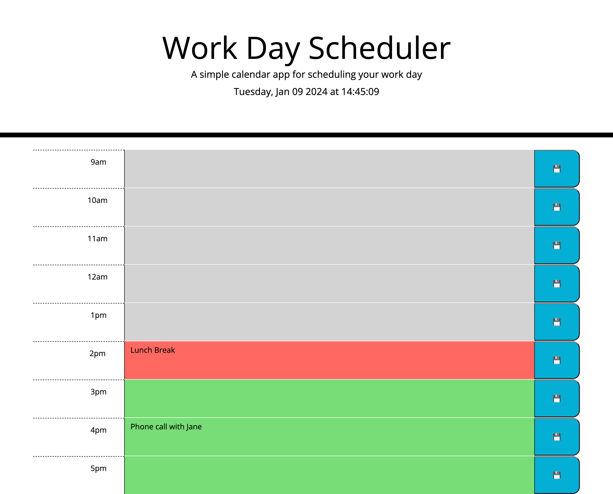

# DAILY PLANNER

## Description

Create a simple calendar application that allows a user to save events for each hour of a working day (9am-17pm).
This app will run in the browser and feature dynamically updated HTML and CSS powered by jQuery.

It will use the Day.js library to work with date and time. 

## Installation
Website:
https://joeviser.github.io/DailyPlanner/ 

Screenshot Image:

## Usage

It should:

* User clicks on slots on the color-coded calendar and edits the events.
  
* Display the current day at the top of the calender when a user opens the planner.
 
* Present time blocks for standard business hours when the user scrolls down.
 
* Color-code each time block based on past, present, and future when the time block is viewed.
 
* Allow a user to enter an event when they click a time block

* Save the event in local storage when the save button is clicked in that time block.

* Persist events between refreshes of a page

The following image shows the web application's appearance:

## Credits

"N/A"

## License

Please refer to the LICENCE in the repo.